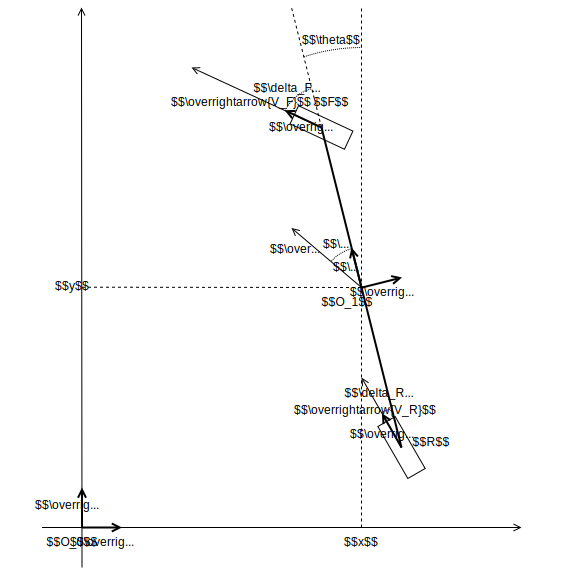
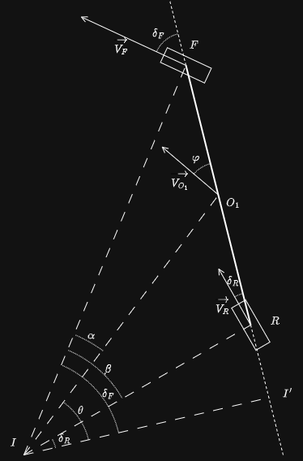

# Bicycle kinematic model

This repo gives and demonstrates the bicycle kinematic model.

The bicycle kinematic model is a simplified mathematical model used to describe
and simulate the motion of a wheeled vehicle, such as a car, in two dimensions.
This model is commonly used in robotics and autonomous vehicle navigation
because it captures the key aspects of how vehicles steer and move without
complex dynamics. By treating the vehicle as a two-wheeled "bicycle", this model
represents the vehicle's front and rear wheels as two points connected by a
rigid body.

## Parameters



The ground has the $R_0 (O_0, \overrightarrow{x_0}, \overrightarrow{y_0},
\overrightarrow{z_0} )$ frame such as $\overrightarrow{z_0}$ is vertical
ascending.

The vehicle has the $R_1 (O_1, \overrightarrow{x_1}, \overrightarrow{y_1},
\overrightarrow{z_1} )$ frame such as :
* $O_1$ belongs the the axle.
* $\overrightarrow{x_1}$ is toward the right of the vehicle.
* $\overrightarrow{y_1}$ is toward the front of the vehicle.
* $\overrightarrow{z_1} = \overrightarrow{z_0}$

Let $F$ be the point at the center of the front wheel.  
Let $R$ be the point at the center of the rear wheel.  
Let $L$ be the wheelbase of the vehicle, i.e. the distance $\overline{RF}$.

The steering angle of the front wheel is $\delta_F$.  
The steering angle of the rear wheel is $\delta_R$.

The body slip angle is $\varphi$.

The position of the vehicle within the $R_0$ frame is given by the parameters
$x$, $y$ and $\theta$ such as :
* $\overrightarrow{O_0O_1} = x \times \overrightarrow{x_0} + y \times
\overrightarrow{y_0}$
* $\theta = \left(\overrightarrow{x_0}, \overrightarrow{x_1} \right) $

The aim of this study is to give the time derivative of $x$, $y$ and $\theta$ as
a function of the speed of the vehicle ($V_{O_1}$), the steering angles
($\delta_F$ and $\delta_R$) and the geometry of the vehicle.

## Model computation

### Yaw rate

According to the solid kinematics formula, one has :
```math
\overrightarrow{V_{F\in R_1/R_0}} = \overrightarrow{V_{R\in R_1/R_0}}
+ \overrightarrow{FR} \wedge \overrightarrow{\Omega_{R_1/R_0}}
```

It can be written :
```math
V_F \overrightarrow{x_F} = V_R \overrightarrow{x_R}
- L\overrightarrow{y_1} \wedge \dot \theta \overrightarrow{z}
```

With :
* $\overrightarrow{x_F} =
-\sin(\delta_F)\overrightarrow{x_1}+\cos(\delta_F)\overrightarrow{y_1}$
* $\overrightarrow{x_R} =
-\sin(\delta_R)\overrightarrow{x_1}+\cos(\delta_R)\overrightarrow{y_1}$

In the $R_1$ frame :
```math
V_F \left( -\sin(\delta_F)\overrightarrow{x_1} 
   + \cos(\delta_F)\overrightarrow{y_1} \right)
= V_R \left( -\sin(\delta_R)\overrightarrow{x_1}
   + \cos(\delta_R)\overrightarrow{y_1} \right)
   - L \dot \theta \overrightarrow{x_1}
```

On $\overrightarrow{x_1}$ :
```math
\begin{aligned}
&-V_F \sin(\delta_F) = -V_R \sin(\delta_R) - L \dot \theta \\
\iff &\dot \theta = \frac{1}{L} \times
\left( V_F \sin(\delta_F) -  V_R \sin(\delta_R) \right)
\end{aligned}
```

On $\overrightarrow{y_1}$ :
```math
\begin{aligned}
&V_F \cos(\delta_F) = V_R \cos(\delta_R) \\
\iff &V_F = V_R \frac{\cos(\delta_R)}{\cos(\delta_F)}
\end{aligned}
```

So :
```math
\begin{aligned}
\dot \theta
&= \frac{1}{L} \times \left(
V_R \frac{ \cos(\delta_R)}{\cos(\delta_F)} \sin(\delta_F) -  V_R \sin(\delta_R)
\right) \\
&= V_R\frac{\cos(\delta_R)}{L}\times\left(\tan(\delta_F)-\tan(\delta_R)\right)
\end{aligned}
```

### Body slip angle

The last computed formula gives the Optibus yaw rate depending on the speed of
the rear axle.  
One would like to have it depending on the speed of the point $O_1$.  
One wants to have the speed on the $R$ point depending on the speed of the $O_1$
point.

According to the solid kinematics formula, one has :
```math
\overrightarrow{V_{R\in R_1/R_0}} = \overrightarrow{V_{O_1\in R_1/R_0}}
+ \overrightarrow{RO_1} \wedge \overrightarrow{\Omega_{R_1/R_0}}
```

So :
```math
V_R=V_{O_1}\frac{cos(\varphi)}{cos(\delta_R)}
```

One shall express $\varphi$ depending on the input parameters $\delta_R$ and
$\delta_F$ and the dimensions of the vehicle ($\overline{O_1F}$ and
$\overline{O_1R}$ ).



* $\alpha = \delta_F - \varphi $
* $\beta = \delta_F - \delta_R $

Considering the triangle $O_1FI$, one can write :
```math
\frac{\overline{O_1F}}{\sin(\alpha)} =
\frac{\overline{IF}}{\sin \left( \frac{\pi}{2} + \varphi \right)}
```

Considering the triangle $RFI$, one can write :
```math
\frac{\overline{RF}}{\sin(\beta)} =
\frac{\overline{IF}}{\sin \left( \frac{\pi}{2} + \delta_R \right)}
```

So one has :
```math
\begin{aligned}
\frac{1}{\overline{IF}}
=&\frac{1}{\overline{O_1F}}
\frac{\sin(\alpha)}{\sin\left(\frac{\pi}{2}+\varphi\right)}
=
\frac{1}{\overline{RF}}
\frac{\sin(\beta)}{\sin \left( \frac{\pi}{2}+\delta_R \right)} \\

\iff &\frac{1}{\overline{O_1F}}  \frac{\sin(\delta_F - \varphi)}{\cos(\varphi)}
=
\frac{1}{\overline{RF}} \frac{\sin(\delta_F - \delta_R)}{\cos(\delta_R)} \\

\iff &\frac{1}{\overline{O_1F}} \frac{\sin(\delta_F) \cos(\varphi)
    - \cos(\delta_F)\sin(\varphi)}{\cos(\varphi)}
=
\frac{1}{\overline{RF}}\frac{\sin(\delta_F)\cos(\delta_R)
    - \cos(\delta_F)\sin(\delta_R)}{\cos(\delta_R)} \\

\iff &\frac{1}{\overline{O_1F}}\left( \sin(\delta_F)
    - \cos(\delta_F)\tan(\varphi) \right)
=
\frac{1}{\overline{RF}}\left( \sin(\delta_F)
    - \cos(\delta_F)\tan(\delta_R)\right) \\

\iff &\frac{1}{\overline{O_1F}}\left( \tan(\delta_F) - \tan(\varphi) \right)
=
\frac{1}{\overline{RF}}\left( \tan(\delta_F) - \tan(\delta_R)\right) \\

\iff& \tan(\varphi) =
\tan(\delta_F) - \frac{\overline{O_1F}}{\overline{RF}} \times
\left( \tan(\delta_F) - \tan(\delta_R) \right) \\

\iff& \tan(\varphi) =
\left( 1 - \frac{\overline{O_1F}}{\overline{RF}} \right) \tan(\delta_F) +
\frac{\overline{O_1F}}{\overline{RF}} \tan(\delta_R) \\

\iff& \tan(\varphi) =
\frac{\overline{RO_1}}{\overline{RF}}\tan(\delta_F) +
\frac{\overline{O_1F}}{\overline{RF}} \tan(\delta_R) \\

\iff& \varphi = \arctan \left(
\frac{\overline{RO_1}}{\overline{RF}}\tan(\delta_F) +
\frac{\overline{O_1F}}{\overline{RF}} \tan(\delta_R) \right)\\

\end{aligned}
```

### Speed of the point $O_1$

We want to get the speed of the point $O_1$ :
```math
\overrightarrow{V_{{O_1}\in R_1/R_0}} = \begin{pmatrix}
\dot x\\ 
\dot y
\end{pmatrix}_{R_0}
```

And we also have :
```math
\overrightarrow{V_{{O_1}\in R_1/R_0}} = V_{O_1}\overrightarrow{u_1}
```

Knowing that $\overrightarrow{u_1}=-\sin(\varphi+\theta)\overrightarrow{x_0}
+\cos(\varphi+\theta)\overrightarrow{y_0} $

We have :
$$
\overrightarrow{V_{{O_1}\in R_1/R_0}} =
V_{O_1} \left( -\sin(\varphi+\theta)\overrightarrow{x_0}
+\cos(\varphi+\theta)\overrightarrow{y_0} \right)
$$

So :
```math
\left\{
\begin{aligned}
\dot x &= V_{O_1} \times -\sin( \varphi + \theta ) \\
\dot y &= V_{O_1} \times \cos( \varphi + \theta )
\end{aligned}
\right.
```

### Bicycle model formulas

To sum up, the kinematic model of a bicycle is :
```math
\left\{
\begin{aligned}
\dot x &= -V_{O_1}\sin( \theta + \varphi ) \\
\dot y &= V_{O_1}\cos( \theta + \varphi ) \\
\dot \theta &= V_{O_1}\frac{\cos(\varphi)}{L}\times\left(\tan(\delta_F)
  -\tan(\delta_R)\right) \\
\varphi &= \arctan \left(\frac{\overline{R{O_1}}}{L}\tan(\delta_F)
  +\frac{\overline{{O_1}F}}{L} \tan(\delta_R) \right)
\end{aligned}
\right.
```